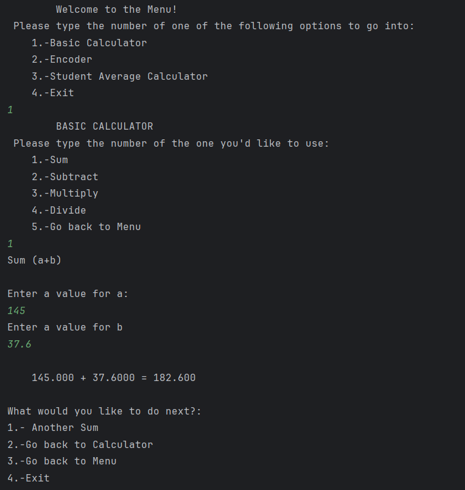

# Basic Utils Application

## Description
This is a Java exercise that offers 3 options through a menu in console: 

### Basic Calculator
Uses a functional interface to process 4 basic operations: 
* Sum (a+b)
* Subtraction (a-b)
* Multiplication (a*b)
* Division (a/b)

### Encoder
Encodes or Decodes a String to/from Base64.

### Student Average Calculator
Asks for details of a student (name, grades, etc.) and returns a formatted table of courses, their grades and grade average. 

## Table of Contents
* [Important Links](#important-links)
* [Usage Information](#usage-information)
* [Test Instructions](#tests-instructions)

## Important Links
* [Github Repository](https://github.com/XimenaFernandezdelCCu/BasicUtilsEx)

## Usage Information
Once the program runs, the menu will appear in the console.
To navigate it, input in the console the value of the option you want to use. 
After every use, another menu will appear and prompt you what to do next or exit.

## Tests Instructions
Unit tests for the Basic Calculator are provided. 

## Author
Ximena Fernández del Castillo 
